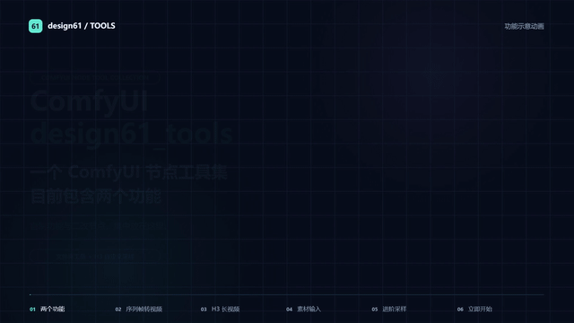

# ComfyUI_design61_tools

这是一个 **ComfyUI 节点工具集**，用于收纳 design61 自制和二次修改的节点。目前包含两个功能：

## 1. 根据路径，把文件夹内的序列帧转成视频

输入序列帧所在的文件夹路径，使用 FFmpeg 将里面的图片编码为视频，不需要把所有帧先加载到 ComfyUI 画布里。另提供一个独立的「清空文件夹序列帧」节点，方便处理生成后的帧文件。

| 节点 | 功能 |
| --- | --- |
| 文件夹序列帧直接FFmpeg视频_design61 | 按指定路径读取文件夹内的序列帧并编码为视频 |
| 清空文件夹序列帧_design61 | 按原工具规则清理指定文件夹内的序列帧 |

使用前需要准备 FFmpeg。节点依次查找：指定的 FFmpeg 路径、插件内的 `ffmpeg` 目录、系统 PATH。本包不包含 FFmpeg 二进制。

## 2. 搭配 H3 Continuum，通过自定义采样生成长视频

本功能用于搭配 [**ComfyUI-H3-Continuum**](https://github.com/ukr8b3g-cmyk/ComfyUI-H3-Continuum)，使用它的分段续写能力生成长视频。具体功能和实现原理请查看原插件项目。

我们在原插件的基础上，把原本合在一起的节点功能拆开，让 **Conditioning、latent 准备、序列控制与采样分离**。这样，中间的采样就可以使用你自己连接的节点，而不是固定在原插件内部。

最基础的用法是 **单采长视频**：每一段经过你的采样节点，完成后继续下一段。也可以在此基础上实现 **双采、两次采样之间的 latent 放大、latent 二采放大**等进阶玩法。

保留自动多段和逐段 Review：可以接受当前段并继续、到当前段结束、重试当前段，或者从第一段重新开始。素材辅助节点继续使用原版插件，支持按 chunk 选择参考图、驱动音频和 VAE、视频序列帧以及参考音频合集。

| 拆分节点 | 功能 |
| --- | --- |
| H3 Continuum External Sequence Start_design61 | 设置段数和每段时长，控制序列开始，显示时长与进度 |
| H3 Continuum External Conditioning_design61 | 提供当前段的 Conditioning 和模板 latent |
| H3 Continuum External Prepare_design61 | 接入续写上下文，为外部采样准备 model、conditioning 和 latent |
| H3 Continuum External Sequence End_design61 | 接收采样结果，控制继续、结束、重试和历史 Take |

原版的 Sampler、Reference Images、Reference Audios、Video Adapter、Finalize 不在本工具集中重复注册。采样器与 latent 放大器由外部节点提供。

### 单采长视频工作流案例

[**下载 MiniMax H3 自定义单采长视频工作流**](examples/MiniMax_H3_single_sampler_design61.json)

这是 design61 提供的单采案例，可以从它开始了解连接方式，再按需要扩展成双采或 latent 二采放大。工作流保留原有接线和参数，公开副本仅恢复了 Core 节点的标准显示名称。

案例依赖和使用说明见 [examples/README.md](examples/README.md)。更详细的拆分节点连接方式见 [H3 自定义采样进阶说明](docs/H3_EXTERNAL_SAMPLING.md)。

## 安装

在 ComfyUI 的 `custom_nodes` 目录执行：

```bash
git clone https://github.com/design61/ComfyUI_design61_tools.git
```

也可以到 [Releases](https://github.com/design61/ComfyUI_design61_tools/releases/latest) 下载插件 ZIP，将 `ComfyUI_design61_tools` 文件夹解压到 `custom_nodes`。随后重启 ComfyUI 并刷新页面。节点名称都带 `_design61` 后缀。

使用 H3 长视频功能时，需要同时安装原版 [ComfyUI-H3-Continuum](https://github.com/ukr8b3g-cmyk/ComfyUI-H3-Continuum)、支持 MiniMax H3 的 ComfyUI、相应模型与音视频 VAE，以及案例使用的其他外部节点。模型、VAE 和素材不在本包中。

已经安装旧 `ComfyUI_FolderFramesToVideo_design61` 的用户，应禁用旧目录，避免相同节点 ID 重复注册，并保留需要的配置和 FFmpeg 文件。

## 介绍动画

[](https://github.com/design61/ComfyUI_design61_tools/releases/download/v0.1.1/design61-intro.mp4)

[观看介绍视频](https://github.com/design61/ComfyUI_design61_tools/releases/download/v0.1.1/design61-intro.mp4) · [HTML/Canvas 动画源码](docs/intro)

动画为功能示意，不是生成效果或 GPU 实测录屏；使用本地 HTML/Canvas 与 FFmpeg 制作。

## 来源、许可与验证

H3 相关功能基于原版项目二次修改，保留其 MIT 许可证和作者署名。文件夹工具由 design61 提供。本项目为独立工具集，使用 [MIT License](LICENSE)，来源说明见 [THIRD_PARTY_NOTICES.md](THIRD_PARTY_NOTICES.md)。

初版完成了 30 项 CPU 测试、合成 Core 执行及原版辅助节点互通、PackedLayout / Finalize、FFmpeg 编码检查。v0.1.1 补充了 Review 按钮经过 Reroute 的回归检查，并在实际 ComfyUI 前端逐按钮点击验证（拦截入队，未执行模型生成）。GPU 生成质量和不同用户环境仍需实际验证，暂未发布到 ComfyUI Registry。

以后新增的自制功能会继续收纳在这个工具集中。
